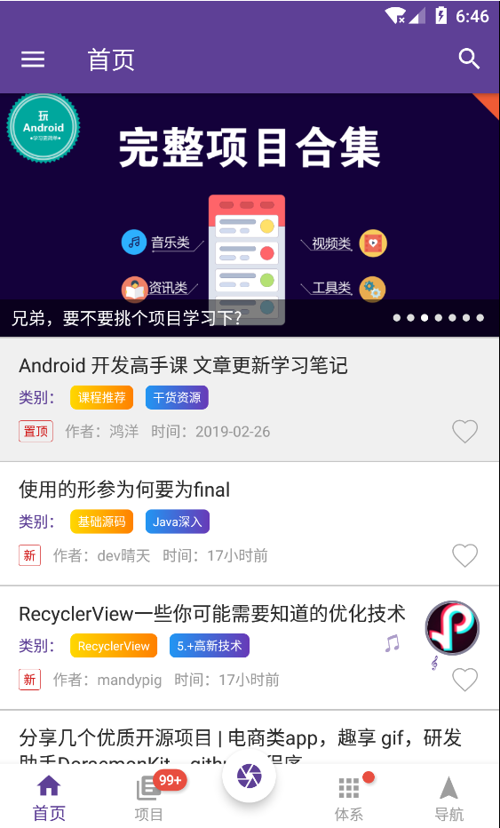
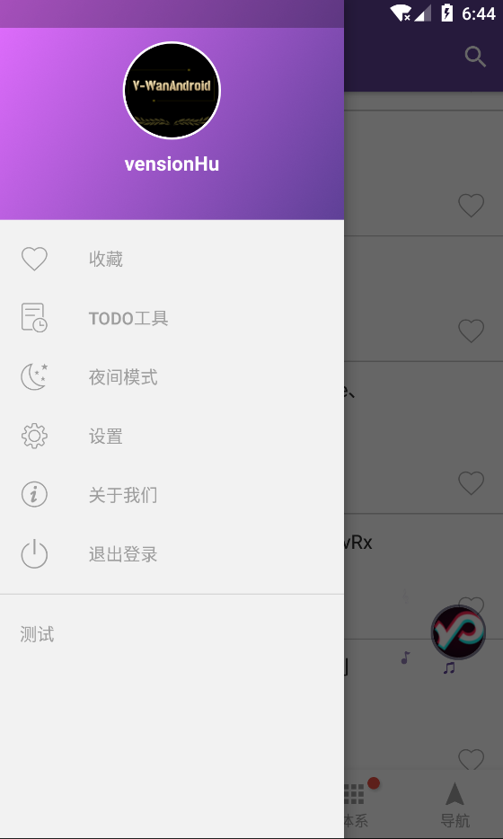
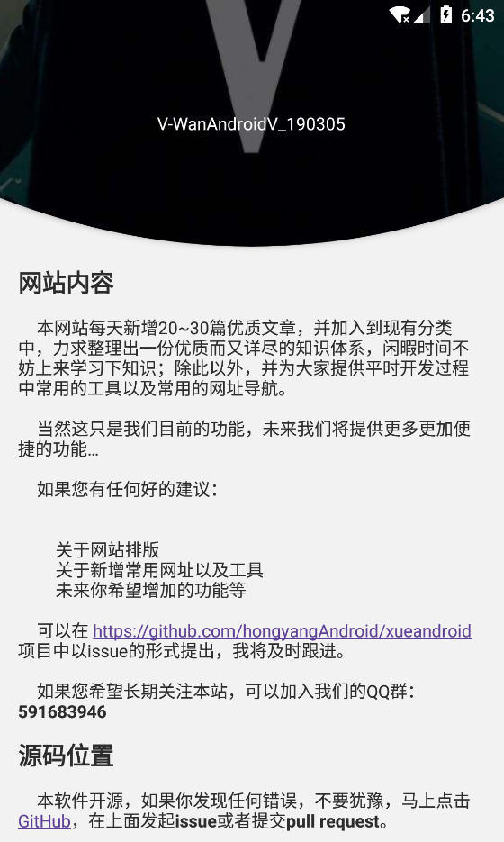
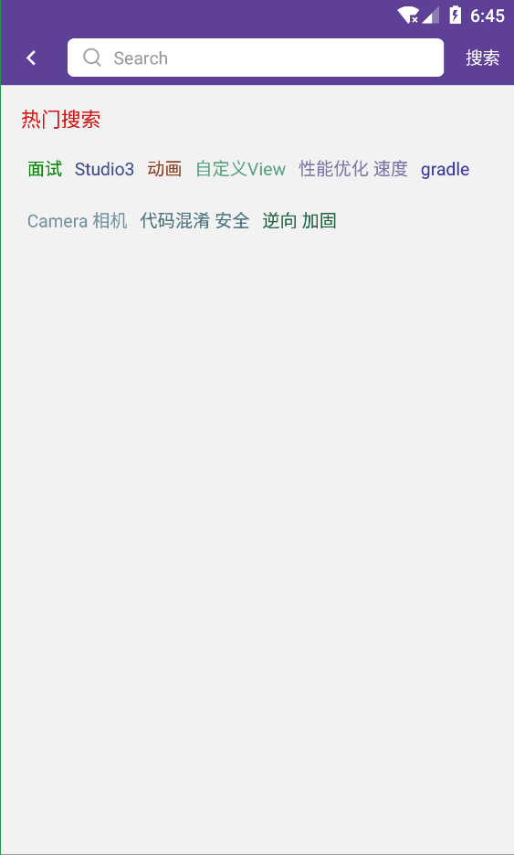
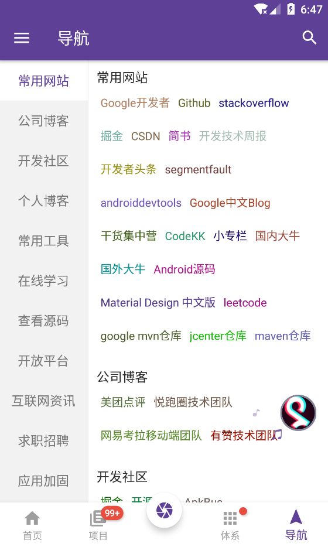
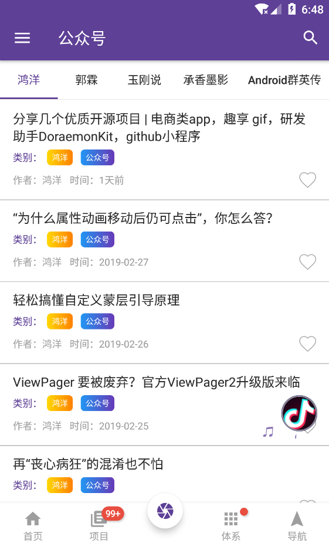
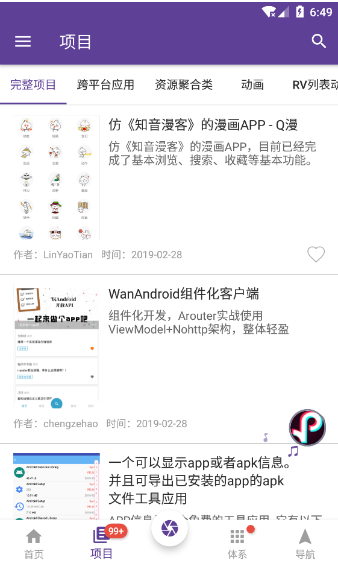
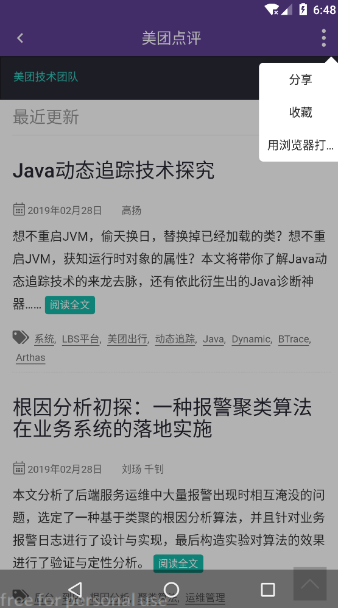
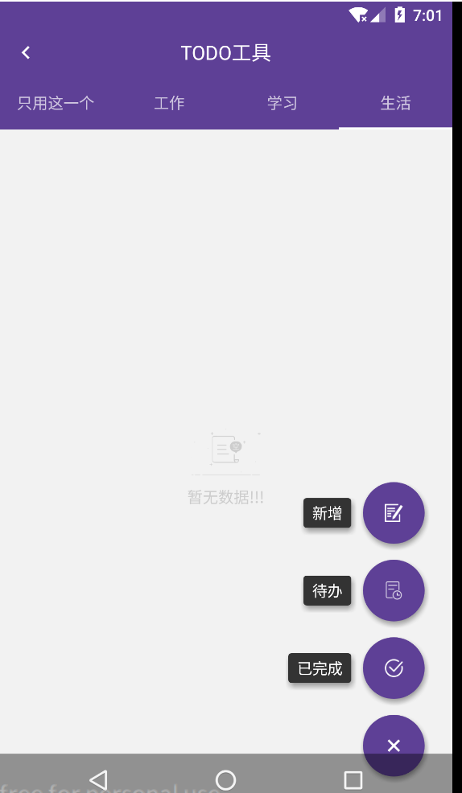

# V-WanAndroid

[![Platform][1]][2]  [![Build Status][3]][4]  [![Release][5]][6]  [![Release][7]][8]  [![GitHub license][9]][10]

[1]:https://img.shields.io/badge/platform-Android-blue.svg  
[2]:https://github.com/vension/V-WanAndroid

[3]:https://travis-ci.org/vension/V-WanAndroid.svg?branch=master
[4]:https://travis-ci.org/vension/V-WanAndroid

[5]:https://img.shields.io/badge/API-19%2B-brightgreen.svg?style=flat
[6]:https://android-arsenal.com/api?level=19

[7]:https://img.shields.io/github/release/vension/V-WanAndroid.svg
[8]:https://github.com/vension/V-WanAndroid/releases/latest

[9]:https://img.shields.io/badge/license-Apache%202-blue.svg
[10]:https://github.com/vension/V-WanAndroid/blob/master/LICENSE


## 简介
[V-WanAndroid](https://github.com/vension/V-WanAndroid) wanAndroid api 练习项目，采用 `Kotlin` 语言编写，结合 `MVP` + `RxJava` + `Retrofit` + `Glide` + `EventBus` 等架构设计的项目，项目代码结构清晰并且有详细注释，如有任何疑问和建议请提 [Issues](https://github.com/vension/V-WanAndroid/issues)

## API
[**玩 Android 开放 API**](http://www.wanandroid.com/blog/show/2)


## Preview
<p>
    
</p>
<div>
    
    
    
    
    
    
    
    
    
</div>

## 主要开源框架
 - [RxJava](https://github.com/ReactiveX/RxJava)
 - [RxAndroid](https://github.com/ReactiveX/RxAndroid)
 - [RxKotlin](https://github.com/ReactiveX/RxKotlin)
 - [Retrofit](https://github.com/square/retrofit)
 - [okhttp](https://github.com/square/okhttp)
 - [Glide](https://github.com/bumptech/glide)
 - [Anko](https://github.com/Kotlin/anko)
 - [moshi-kotlin](https://github.com/square/moshi)
 - [android-titlebar](https://github.com/wuhenzhizao/android-titlebar)
 - [SwipeBackLayout](https://github.com/gongwen/SwipeBackLayout)
 - [BottomNavigationViewEx](https://github.com/ittianyu/BottomNavigationViewEx)
 - [BadgeView](https://github.com/qstumn/BadgeView)
 - [EventBus](https://github.com/greenrobot/EventBus)
 - [BRVH](https://github.com/CymChad/BaseRecyclerViewAdapterHelper)
 - [Logger](https://github.com/orhanobut/logger)
 - [RxPermissions](https://github.com/tbruyelle/RxPermissions)
 - [AgentWeb](https://github.com/Justson/AgentWeb)
 - [FlowLayout](https://github.com/hongyangAndroid/FlowLayout)
 - [BGABanner-Android](https://github.com/bingoogolapple/BGABanner-Android)
 - [VerticalTabLayout](https://github.com/qstumn/VerticalTabLayout)
 - [LitePal](https://github.com/LitePalFramework/LitePal)
 - [FloatingActionButton](https://github.com/Clans/FloatingActionButton)
 - [其他...]()

## update
* **V1.0.0**: <初始化版本>

## Thanks
**感谢所有优秀的开源项目 ^_^** 。

## Statement
**项目中的 API 均来自于 [www.wanandroid.com](http://www.wanandroid.com/) 网站，纯属学习交流使用，不得用于商业用途。**

## License
```
 Copyright 2019, Vension

   Licensed under the Apache License, Version 2.0 (the "License");
   you may not use this file except in compliance with the License.
   You may obtain a copy of the License at

       http://www.apache.org/licenses/LICENSE-2.0

   Unless required by applicable law or agreed to in writing, software
   distributed under the License is distributed on an "AS IS" BASIS,
   WITHOUT WARRANTIES OR CONDITIONS OF ANY KIND, either express or implied.
   See the License for the specific language governing permissions and
   limitations under the License.
```